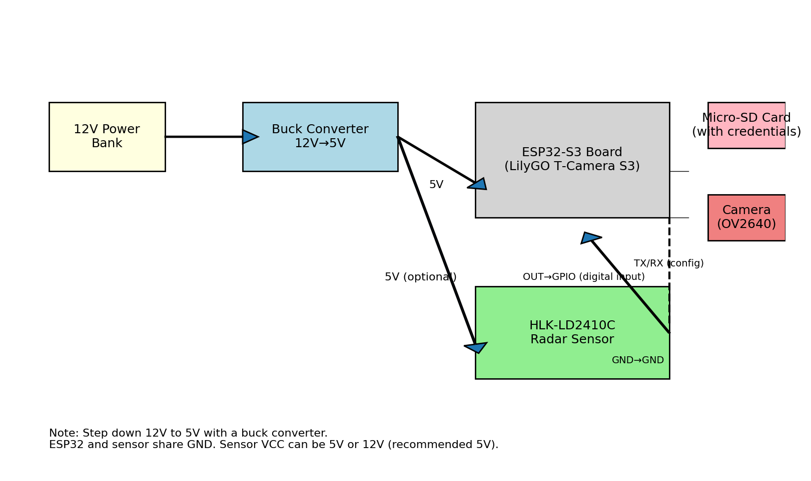

# ESP32‑S3 Motion‑Activated Camera with Radar Sensor

This project uses an ESP32‑S3 board with a built‑in OV2640 camera and micro‑SD slot together with an **HLK‑LD2410C 24 GHz radar sensor** for presence/motion detection. When the radar sensor’s OUT pin goes high, the board captures a JPEG image and saves it to the SD card. Images are named using a timestamp. Wi‑Fi is used **only** to synchronize the clock via NTP; credentials are stored in a `credentials.txt` file on the SD card. After each capture, the sketch waits **10 seconds** before listening for motion again.

## Features

- Uses an ESP32‑S3 with built‑in OV2640 camera and micro‑SD slot.
- 24 GHz radar sensor (**HLK‑LD2410C**) provides motion/presence detection.
- Captures a JPEG image when radar reports presence.
- Saves images to the micro‑SD card with filenames like `YYYYMMDD_HHMMSS.jpg`.
- Reads Wi‑Fi credentials from a `credentials.txt` file on the micro‑SD card.
- Connects to Wi‑Fi only to fetch the current time via NTP for timestamping.
- Waits **10 seconds** between captures to avoid spamming the SD card.
- Separate power rails: the board is powered from 5 V (via a buck converter if using a 12 V source).  The radar sensor is powered from the same 5 V; all grounds must be common.

## Hardware and connections

- **ESP32‑S3 board** – choose one with a built‑in camera and micro‑SD slot (e.g. LilyGO T‑Camera S3 or Seeed XIAO ESP32S3 Sense).
- **HLK‑LD2410C radar sensor** (24 GHz FMCW presence sensor).
- **Micro‑SD card** formatted as FAT‑32.
- **12 V power bank** plus a **buck converter** to step down to 5 V if your board requires 5 V.
- **Dupont wires** for the connections.

### Wiring

- Connect **VCC** of the radar sensor to the 5 V output of the buck converter.
- Connect **GND** of the radar sensor to the ESP32 ground.
- Connect the sensor’s **OUT** pin to `RADAR_PIN` (default GPIO 13) on the ESP32‑S3.
- Optionally connect **TX/RX** pins for configuration (not required for simple digital output).
- Power the ESP32‑S3 board with 5 V from the buck converter.  If your power source is 12 V, the buck converter will step it down.
- All grounds must be common.

Here is a connection diagram:



## Preparation

1. Format the micro‑SD card as FAT‑32.
2. Create a text file `/credentials.txt` on the SD card with two lines (no extra spaces):
   ```
   MyWiFiSSID
   MyWiFiPassword
   ```
3. Insert the card into the board’s slot.

## Sketch

The Arduino sketch is provided in `main.ino`. It uses the `esp_camera` driver to capture JPEG images, `SD_MMC` to write to the SD card, `WiFi` to connect to your access point and `time.h` to obtain timestamps via NTP.  In `setup()` it mounts the SD card, reads Wi‑Fi credentials from `/credentials.txt`, connects to Wi‑Fi, configures the time, sets up the radar pin as an input and initializes the camera.  In `loop()` it polls the radar pin; when it goes HIGH and at least 10 seconds have passed since the last shot, it captures an image, generates a timestamped filename, writes it to the SD card and waits 10 seconds before checking again.

You can adjust the following in `main.ino`:

- **`RADAR_PIN`** if your radar sensor is connected to a different GPIO.
- **`RADAR_DETECTED`** if your sensor uses the opposite logic level.
- Camera resolution and JPEG quality via the `config.frame_size` and `config.jpeg_quality` fields.

## Building and uploading

1. Install the **ESP32** board package in the Arduino IDE.
2. Select **ESP32S3 Dev Module** (or your specific board) under **Tools > Board**.
3. Install the required libraries: `esp_camera`, `WiFi`, `SD_MMC` and `FS` (these come with the ESP32 core).
4. Open `main.ino`, verify the pin assignments, Wi‑Fi credentials file name and NTP server, and upload the sketch.
5. Insert the prepared micro‑SD card and power the board.  Open the serial monitor to observe status messages.

## Notes

- The ESP32‑S3 must have PSRAM to buffer images efficiently (boards like the LilyGO T‑Camera S3 include PSRAM).
- The radar sensor does **not** classify objects; it simply indicates presence.  If you want to detect cats specifically, you would need to process the camera images with a small machine‑learning model.
- Ensure your Wi‑Fi network provides internet access so the board can fetch the time via NTP; otherwise, timestamps will fall back to `millis()`.
